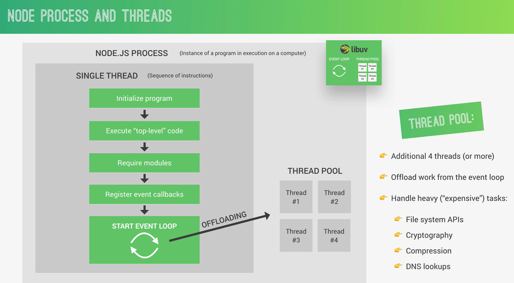
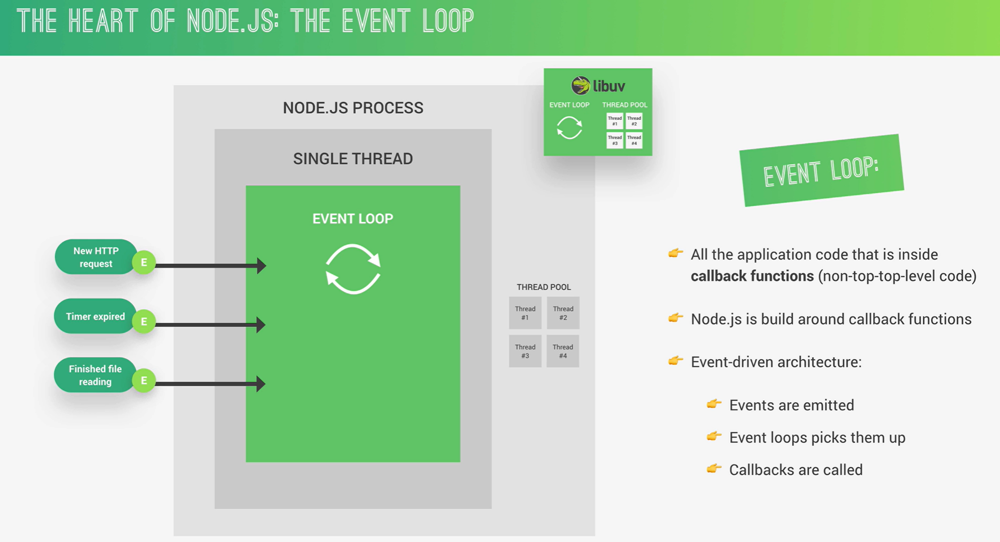
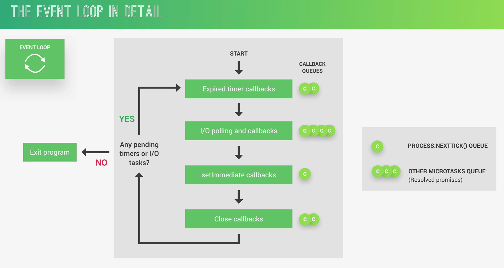
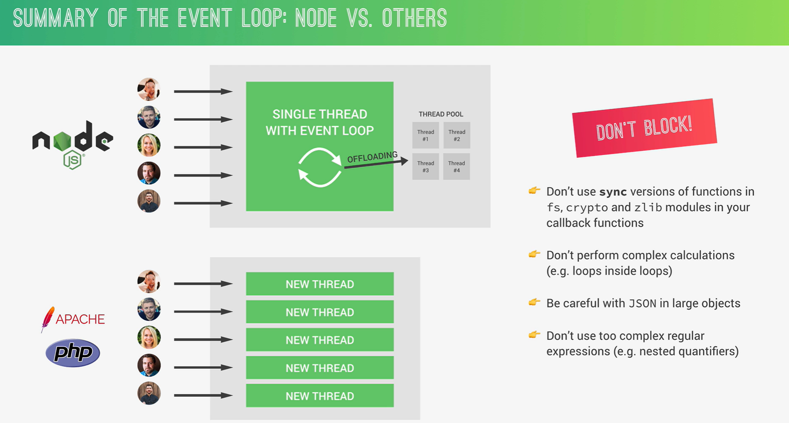
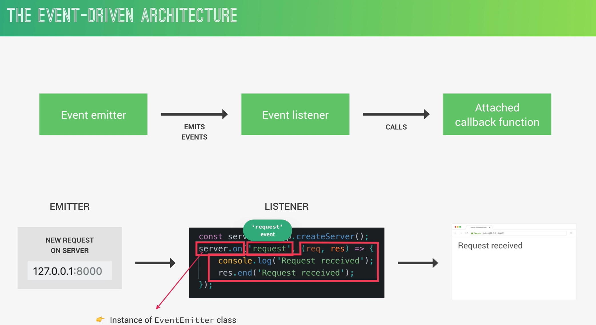
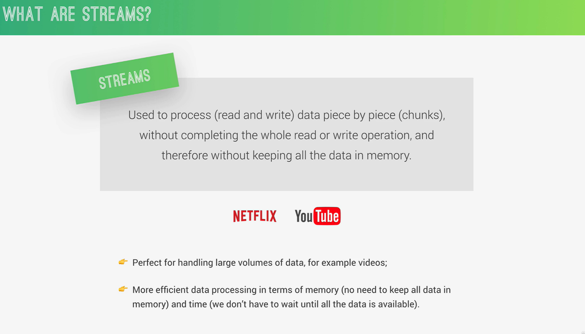
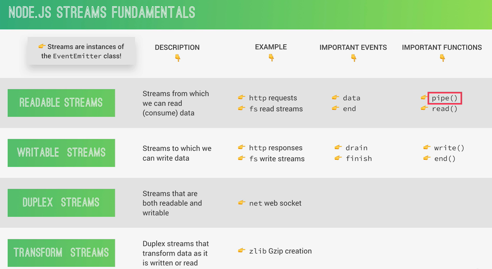

# Complete Node_Js Basic To Advacned 🚀
- [NodeJs-docs](https://nodejs.org/en)

Node.js is a JavaScript runtime environment that allows developers to create scalable and fast network applications. It's built on Chrome's V8 JavaScript engine and provides an event-driven, non-blocking I/O model, making it lightweight and efficient. 

Node.js is often used for building server-side applications, web servers, APIs, and real-time applications.

## Core Node js Module 

## Quick Reference 📔
- [Pm2](https://www.npmjs.com/package/pm2)
- [js Engine ](https://v8.dev/docs)
- [ server side web application](https://www.fullstackfoundations.com/blog/client-side-vs-server-side)
- [benefits of using node js ?](https://www.geeksforgeeks.org/the-pros-and-cons-of-node-js-in-web-development/#google_vignette)
- [core modules](https://nodejs.org/api/documentation.html)
- [repl](https://www.geeksforgeeks.org/how-to-use-node-js-repl/)
- [run node js file](https://nodejs.org/en/learn/command-line/run-nodejs-scripts-from-the-command-line)
- [readFileSync()](https://www.geeksforgeeks.org/node-js-fs-readfilesync-method/)
- [synchronous code](https://www.geeksforgeeks.org/blocking-and-non-blocking-in-node-js/)
- [server side web application ](https://dev.to/dharamgfx/dive-into-server-side-website-programming-from-basics-to-mastery-255f)
- [HTTP Methods ](https://developer.mozilla.org/en-US/docs/Web/HTTP/Methods)
- [DNS](https://www.geeksforgeeks.org/working-of-domain-name-system-dns-server/)
- [static vs Dynamic website](https://www.geeksforgeeks.org/static-vs-dynamic-website/)
- [Api](https://www.ibm.com/topics/api)
- [stateful and stateless applications ](https://www.redhat.com/en/topics/cloud-native-apps/stateful-vs-stateless)
- [npm ](https://www.geeksforgeeks.org/node-js-npm-node-package-manager/)
- [Garbage collection](https://codedamn.com/news/nodejs/garbage-collection-explained)
- [Node process Object](https://jscomplete.com/learn/complete-intro-nodejs/1ni-process-object#:~:text=The%20process%20object%20is%20a,production%2C%20you%20can%20use%20process.)
- [middleware](https://www.ibm.com/topics/middleware)
- 
## NodeJs Architecture 🔥

## Event Loop  
* Event loop does Orchestration

## Event Loop In Details 🚀

## Event Driven Architecture 🔥

# Node Stream 💦

## Top Node js Frameworks 
### Express.js
* Express.js is the most popular and minimalistic web framework for Node.js. 
Express is designed to simplify the backend application development with a robust set of features including routing, middleware, error handling, and templating.
### Nest.js
* Nest.js is a progressive framework for Node.js for building server-side applications with JavaScript and TypeScript. 
* Nest.js follows a modular architecture enabling developers to create complex applications by organizing components into separate, independent modules, ensuring maintainability and reusability across various parts of the application.
### Realtime Node.js Frameworks
* Realtime frameworks provide features and functions to enable simplified development of realtime applications. Realtime applications require realtime flow of information, like with instant messaging or for data analytics dashboards. Here are some of the best realtime Node.js frameworks to consider:

* Socket.IO: Socket.IO is a Node.js framework built on top of WebSockets that enables realtime client-server communication. Socket.IO is event-driven and compatible with older browsers and environments.

## Express installation
### Step 1: Install Express.js
    npm install express
### Step 2: Create a New File

    const express = require('express');
    const app = express();
    
    // Define a route for the root URL ('/') that returns 'Hello World!'
    app.get('/', (req, res) => {
    res.send('Hello World!');
    });
    
    // Start the server
    const port = 3000;
    app.listen(port, () => {
    console.log(`Server started on port ${port}`);
    });
### Step 3: Run the Server
    node app.js
#

## Installing NestJS
- [Nest js  Docs 📔 ](https://nestjs.com/)
### Step 1: Install Node.js
### Step 2: Install NestJS CLI
    npm install -g @nestjs/cli
### Step 3: Create a New Project
    nest new project-name
### Step 4: Install Dependencies
    npm install
### Step 5: Start the Development Server
    npm run start

## Important  Dependencies 🧑‍💻
### Node.js nodemon npm Module
The nodemon npm Module is a module that develop node.js based applications by automatically restarting the node application when file changes in the directory are detected. Nodemon does not require any change in the original code and method of development.

    npm install -g nodemon
### check the current version of the module
    nodemon version
##  body-parser
Parse incoming request bodies in a middleware before your handlers, available under the
    req.body 

    npm i body-parser
## cors
* The CORS (Cross-Origin Resource Sharing) npm module is a Node.js package that enables cross-origin resource sharing for Express.js applications.
* It allows web pages to make requests to a different origin (domain, protocol, or port) than the one the web page was loaded from, which is a restriction imposed by the same-origin policy.
#
    npm i cors
#
    app.use(cors({
    origin: '*',
    methods: ['GET', 'POST', 'PUT', 'DELETE'],
    headers: ['Content-Type', 'Authorization']
    }));

## dotenv 
Dotenv is a popular Node.js package that loads environment variables from a .env file into the process.env object. This allows you to separate sensitive or environment-specific configuration from your code and keep it organized in a single file.

    npm install dotenv

## Pm2 
PM2 is a production process manager for Node.js applications with a built-in load balancer

* Application run Forever unit we stop manually 🚀

Installation ⭐⭐

    npm install pm2 -g

To list all running applications:

    pm2 list

To check Version 

    pm2 --version
To start server

    pm2 start app.js

    
## Important  Node js Questions

    1.	What is the chrome js engine name ? 
    2.	Why and when to use the node js ?
    3.	Explain the concept of the server side web applicaton ?
    4.	What is the benefits of using node js ?
    5.	What are the core module of the node js give me some example of the code module ?
    6.	How to exit the node repl ? 
    7.	How to execute node js file ?
    8.	What is the  use of the readFileSync() , what is the meaning of the sync  ?
    9.	How many parameters take readFileSync and what it is ?
    10.	What is the  purpose of  using  of the character encoding  utf-8  ?
    

    11.	What is the full form of the utf-8 ?
    12.	Explain the working of the writeFileSync ? 
    13.	What is the parameters take writeFileSync ? 
    14.	What is the meaning of the synchronous (blocking ) code ? 
    15.	What is the meaning of the Asynchronous (non- blocking ) code ? 
    16.	How to read and write file in Asynchronous manner ? 
    17.	What is request  and response ? 
    18.	What is the structure of the request ?
    19.	What is host header ?
    20.	What is  user agent header?

    21.	What is accept header ?
    22.	What is accept language header?
    23.	What is the good practice to add custom header ? 
    24.	Explain about the client server architecture ? 
    25.	Explain about the protocols? 
    26.	Explain about  the Domain  name ?
    27.	Explain the working of the DNS  ? 
    28.	What is local dns resolver ?
    29.	How caching work in dns ?
    30.	What is the port number for the http and https?

    31.	Explain  the working of the tcp/ip socket connection ?
    32.	What is the structure of the request message ?
    33.	What is get http methods, why we use  it ?
    34.	Explain the working of the request header ? 
    35.	Explain the working of the request body ?
    36.	What  is difference between the common js and module js ?
    37.	What is the http response ? 
    38.	What is response header ?
    39.	What is the response body ?
    40.	What is difference btw the frontend and backend ?

    41.	What is difference btw the static and dynamic website ?
    42.	Explain what is Api ?
    43.	How api is also know as abstraction layers ?
    44.	What  is difference between the  stateless and stateful web applications ?
    45.	What is  v8 engine ?
    46.	In which language  v8 engine is written ?
    47.	What libuv ?  how it work  asynchronously ?
    48.	In which language Libuv is written ? 
    49.	In which language node js is written ? 
    50.	Explain the Architecture of the Node js with Proper diagram ?

    51.	What is node js process? 
    52.	What is the meaning of the single threaded in node js ?
    53.	How process is executed using single thread behind the scene?
    54.	Explain the working of the thread pool 
    55.	What is task queues ? 
    56.	How event loop works ? 
    57.	Explain the architecture of the event loop in node js ? 
    58.	What is node js event driven architecture ? 
    59.	What is event emitters? 
    60.	What is event listener in the node js  event driven architecture ?

    61.	What is streams ? 
    62.	How many types of streams in the node js ? 
    63.	What is readable streams ?  give one example 
    64.	What is writeable streams  ? give one example ? 
    65.	What is duplex streams ?  give example
    66.	What is transform streams ?  give example 
    67.	What happened when we required a modules ? 
    68.	Who invent the node js ? 
    69.	When node js first introduce ? 
    70.	What is npm ?

    71.	How do you install external package in the node js ?
    72.	How does garbage collection work in node js ? 
    73.	What is the meaning of the ideal time garbage collection  in node js  ? 
    74.	Explain the concept of non/blocking io in node js ? 
    75.	How node js handle concurrency and why is it well suited for scalable applications ?
    76.	How can we read and write  in node js ?
    77.	Give me some framework  name of the node js ? 
    78.	What is express js ?
    79.	What is http modules 
    80.	How can you create a simple http server in node js  ?

    81.	What is the use of the createServer function ? 
    82.	What is the use of the listen function ?
    83.	What is the use of the url module  ? 
    84.	How to create multiple routes in node js using url module ?
    85.	Explain the purpose of the process object ?
    86.	What is the role of the os module in the node js ?
    87.	What is the use of  the os . arch(), release() ,networkInterface(),freemem() ?
    88.	What is difference between the web service and api ?
    89.	What is endurl in api ?
    90.	How many type of the web services ? soap , rest api , xml 

    91.	How do you handle the memory leak in the node js application  , ?
    92.	What is the use of the profiling tools ?
    93.	Explain the role of the cluster module in the node js?
    94.	What is the meaning of the workers process ?
    95.	Explain the working of the master workers architecture ?
    96.	How would you use chaching  in node js to improve the performance ? 
    97.	How can you optimized performance in the node js  ?
    98.	Explain the role of dns module in the node js ?
    99.	Describe the purpose of the pm2 process manager  in the node js ?
    100.	What is piping in node js ?

    101.	How now handle child threads ?
    102.	When should we use node js ?
    103.	What is n-api in node js ?
    104.	How to use global variables in node js ?
    105.	How would you scale node js application ?
    106.	Why do we need c++ addons in node js 
    107.	What do you mean by asynchronous api ?
    108.	Explain uses of  NODE_ENV ?
    109.	Can node js work without v8 ?
    110.	Can node js use other enfines than v8 ?
    
    111.	How many threads does node actually created ?
    112.	What is v8 templates ?
    113.	Why do we need c++ addoms in node js ?
    114.	What are  buffer and why to use them in node js ?
    115.	How do you handle error in the node js ?
    116.	What is the purpose of the crypto module in the node js ?
    117.	Explain the purpose of the websocket protocol and how it can be implemented in a node js applications ?
    118.	Describe the difference between horizontal sacling and vertiacal scaling in the context of  node js  applications ?
    119.	Explain the purpose of the process object in node js ?
    120.	What is difference between the http and https modules in the node js 
    121.	How to change the size of the thread pool  in the node js ?
    122.    How do you use Node.js clusters to improve performance?
    123.    How do you secure a Node.js application from common web vulnerabilities?
    124.    What are some best practices for handling sensitive data in a Node.js application?
    125.    How do you implement authentication and authorization in a Node.js application?
    126.    How do you integrate a Node.js application with a relational database?
    127.    What are some best practices for using MongoDB with Node.js?
    128.    How do you use an ORM like Sequelize with Node.js?
    129.    How do you design a microservices architecture using Node.js?
    130.    How do you write unit tests and integration tests for a Node.js application?
    131.    What are some best practices for debugging a Node.js application?
    132.    How do you deploy a Node.js application to a cloud platform like AWS or Google Cloud?
    133.    What are some best practices for scaling a Node.js application horizontally and vertically?
    134.    How do you use containerization with Docker and Kubernetes to deploy and scale a Node.js application?

## Authors

- [@Ashutosh kumar](https://github.com/Ashukr321)

## 🔗 Links

## 🚀 About Me
I'm ASHUTOSH KUMAR FULLSTACK DEVELOPER

I specialize in creating modern and responsive web applications. With a strong passion for FULLSTACK development, I bring creative solutions to life through code and design. Additionally, I am a winner 🏆 of the GDG Patna WEB Hackathon

## Acknowledgements

* Ashutosh kumar for creating and maintaining this repository.

